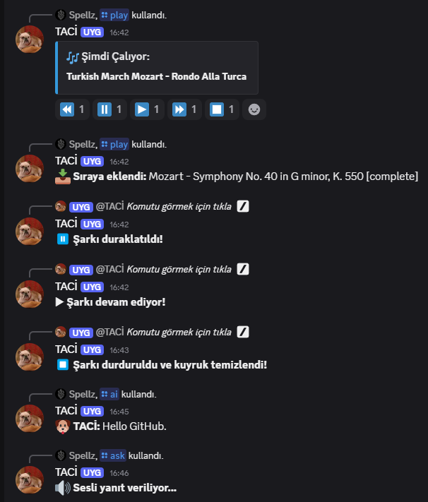

<h1 align="center">🎙️ TACI - Multifunctional Discord Bot</h1>
<p align="center">
  A powerful, AI-integrated Discord bot written in Python.  
  Includes music streaming, Gemini AI conversation, real-time Twitter scraping, and voice features.  
  <br><br>
  🐶 Inspired by <strong>TACI</strong>, the talking dog character from <em>Sihirli Annem</em> — a beloved Turkish TV show from our childhood.  
  Just like the original TACI, this bot has something to say about everything — with a touch of chaos, sass, and lots of voice!

</p>


---

## 🚀 Features

### 🤖 Gemini AI Integration
- `/ai` for text-based conversations
- `/ask` to respond in voice using Gemini-powered text-to-speech
- Generates and speaks responses dynamically

### 🎵 Music Player
- Play from YouTube by name or link
- Queue management (skip, pause, resume, clear, volume)
- Interactive emoji controls (⏪ ⏸ ▶ ⏩ ⏹)

### 🐦 Twitter Integration
- Automatically fetches tweets from specified accounts
- Sends updates directly to chosen Discord channels
- Works even if tweets are pinned or delayed

### 🔊 Voice and Soundboard
- `/speak` command to say anything using Edge TTS
- `/play_sound` plays fun predefined audio
- Welcome voice messages upon user join (customizable)

### 🎮 Fun & Utility
- Slash commands with rich embeds
- Modular structure for easier maintenance
- Periodic status rotation with `cycle_status`

---

## 📁 Project Structure

```
taci-bot/
│
├── bot.py               # Main bot logic
├── commands/            # Custom cog modules
│   ├── twitter_news.py
│   ├── loner_bully.py
│   └── soundboard.py
├── sounds/              # Local audio clips (ignored in repo)
├── .env                 # Contains API keys and secrets
├── tweet_history.json   # Tracks last seen tweets
├── requirements.txt
└── README.md
```

---

## 🔐 Environment Variables

> Make sure you create a `.env` file in the root directory with the following:

```env
DISCORD_TOKEN=your_discord_bot_token
GEMINI_TOKEN=your_google_gemini_api_key
COMMAND_PREFIX=!
```

---

## 🛠️ Installation & Running

```bash
git clone https://github.com/Spellz/taci-bot.git
cd taci-bot
pip install -r requirements.txt
python bot.py
```

---

## ⚠️ Ignored Files

This repository uses a strict `.gitignore` to avoid pushing sensitive and personal files.


---

## 📸 Screenshot

>

---

## 📫 Contact

- 🧑 GitHub: [Speellz](https://github.com/Speellz)
- 🔗 LinkedIn: [Cenk Kağan Çakır](https://www.linkedin.com/in/cenkkaancakir)

---